# 🩺 Chronic Disease Monitoring Web Application

A clean, secure, and patient-friendly web application for monitoring chronic diseases.
The system enables patients to submit health measurements, receive AI-generated medical insights, and obtain doctor-reviewed treatments and prescriptions.

---

## 📌 Application Overview

This project is a **role-based medical monitoring system** with two user roles:

### 👤 Patient

* Submits health measurements
* Receives AI-generated reports
* Gets doctor-reviewed treatments and prescriptions
* Views full medical history

### 👨‍⚕️ Doctor (Single Predefined Account)

* Reviews patient submissions
* Edits AI reports
* Sends final medical reviews and prescriptions

The application is designed to be **smooth, responsive, secure, and accessible**, following modern medical UI/UX principles.

---

## 🛠 Technology Stack

### Frontend

* HTML
* CSS
* Vanilla JavaScript
* Mobile-first responsive design

### Backend

* Firebase handles authentication and database
* JavaScript

### Database

* Firebase Realtime Database

### Authentication

* Firebase Authentication
* Email & password login
* Google login
* Email verification using OTP

### AI Integration
* Health values are obtained from medical sensors 
* Runs **only on the backend**
* Generates medical insights based on submitted health data

---

## 1️⃣ Authentication Screens

<h3 align="center">Login</h3>

<p align="center">
  <strong>Desktop View</strong><br>
  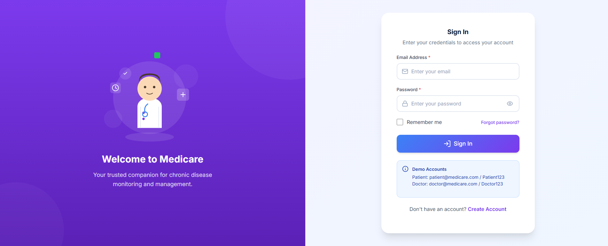
</p>

<p align="center">
  <strong>Mobile View</strong><br>
  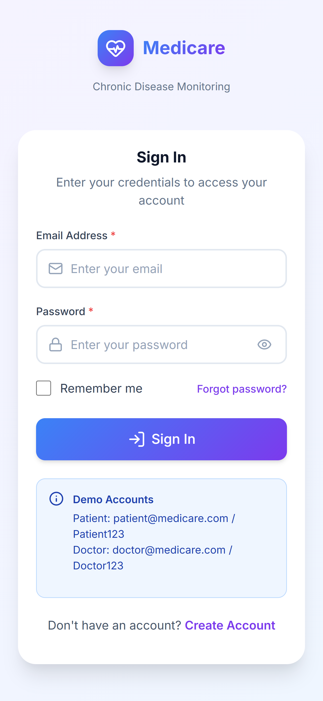
</p>

---

<h3 align="center">Signup</h3>

<p align="center">
  <strong>Desktop View</strong><br>
  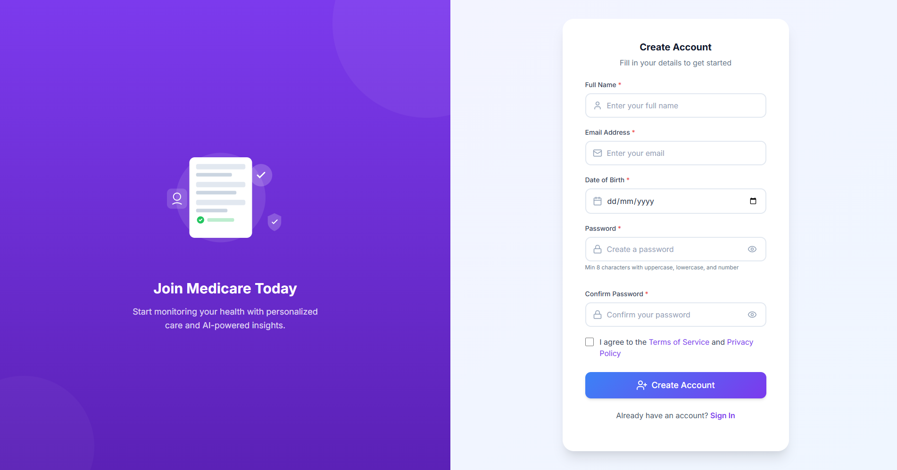
</p>

<p align="center">
  <strong>Mobile View</strong><br>
  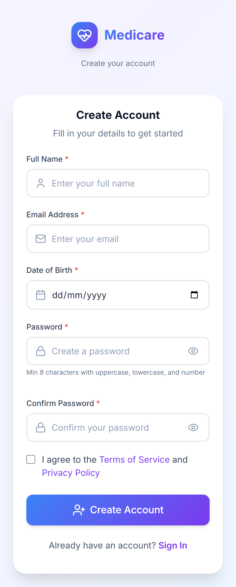
</p>

---

<h3 align="center">Forgot Password</h3>

<p align="center">
  <strong>Email Form</strong><br>
  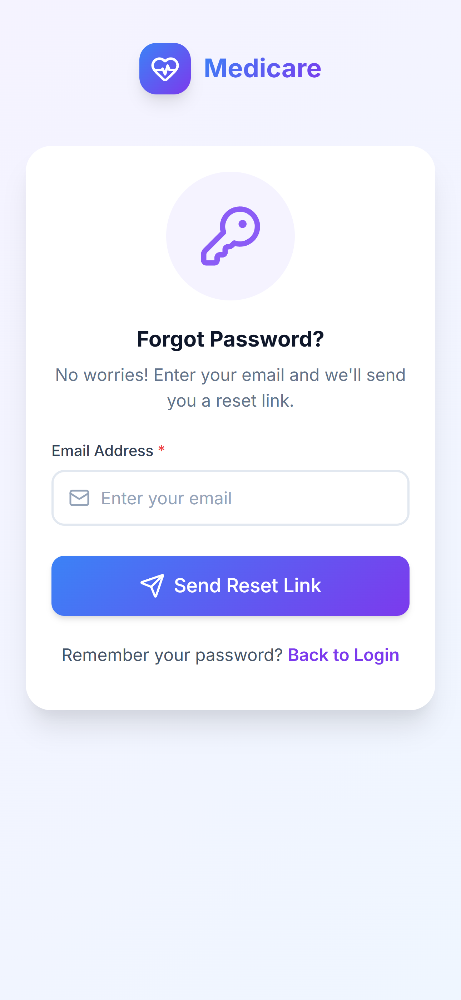
</p>

<p align="center">
  <strong>Success Form</strong><br>
  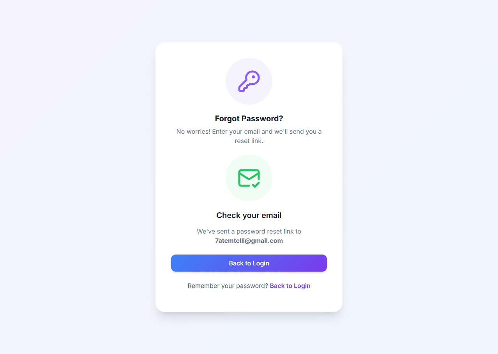
</p>

---

<h3 align="center">Verify Email</h3>

<p align="center">
  <strong>OTP Form</strong><br>
  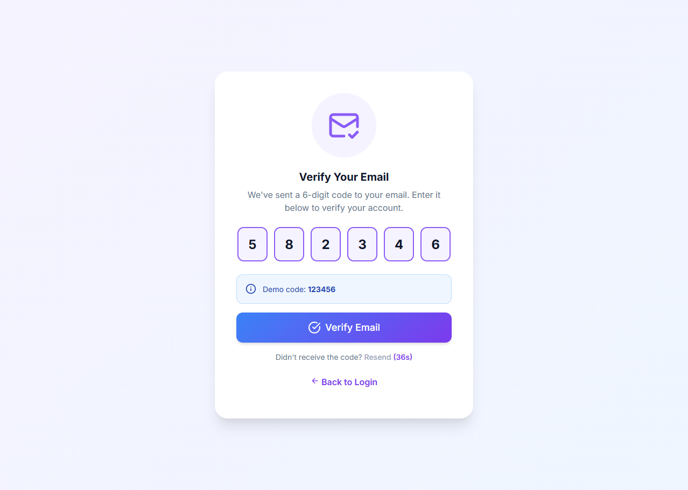
</p>

---

## 2️⃣ Patient Screens 👤

<h3 align="center">Dashboard</h3>

<p align="center">
  <strong>Desktop View</strong><br>
  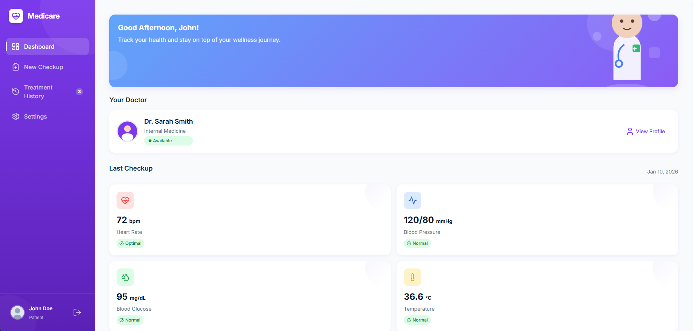
</p>

<p align="center">
  <strong>Mobile View</strong><br>
  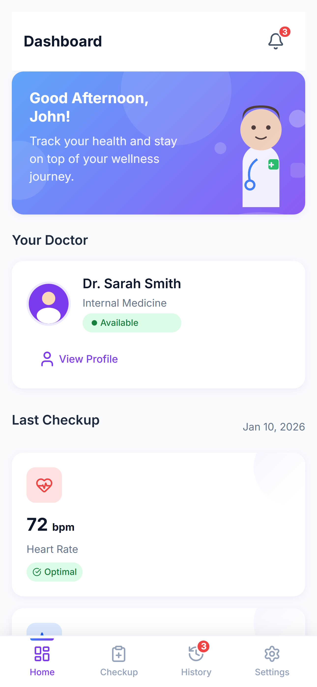
</p>

---

<h3 align="center">New Checkup</h3>

<p align="center">
  <strong>Desktop View</strong><br>
  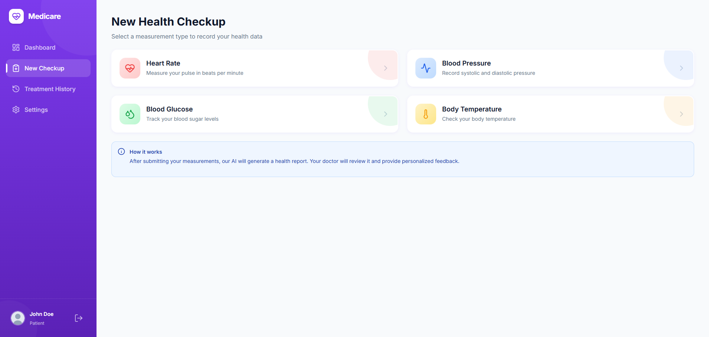
</p>

<p align="center">
  <strong>Mobile View</strong><br>
  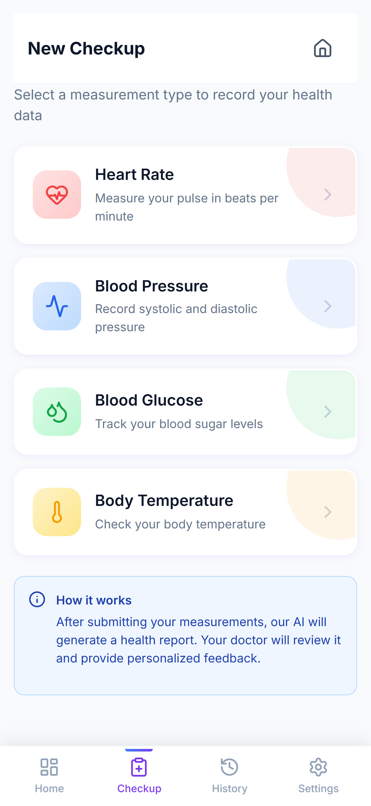
</p>

---

<h3 align="center">Treatment History</h3>

<p align="center">
  <strong>Desktop View</strong><br>
  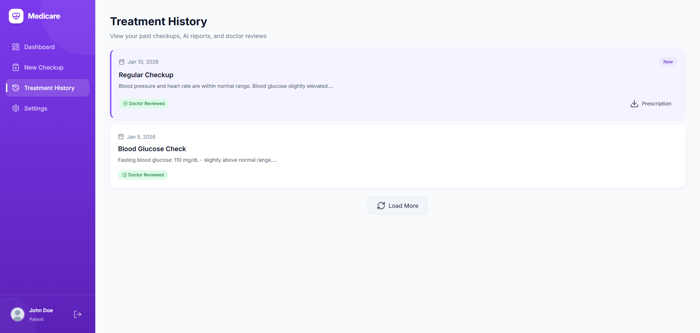
</p>

<p align="center">
  <strong>Mobile View</strong><br>
  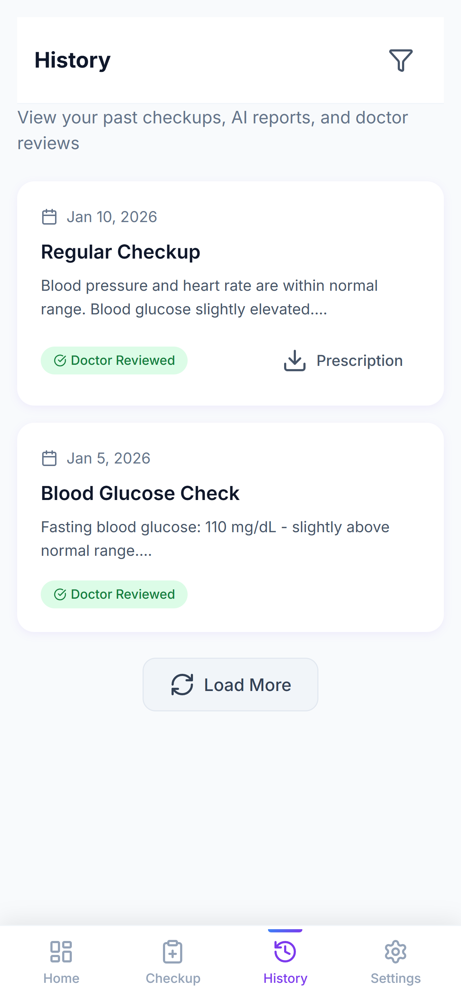
</p>

---

<h3 align="center">Settings</h3>

<p align="center">
  <strong>Desktop View</strong><br>
  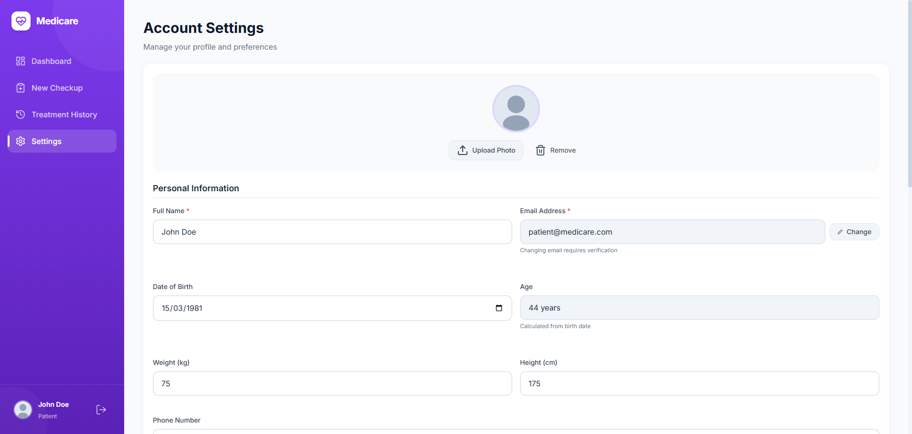
</p>

<p align="center">
  <strong>Mobile View</strong><br>
  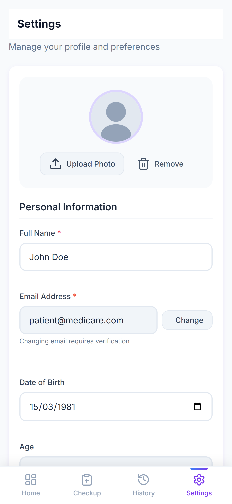
</p>

---

## 3️⃣ Doctor Screens 👨‍⚕️

<h3 align="center">Dashboard</h3>

<p align="center">
  <strong>Desktop View</strong><br>
  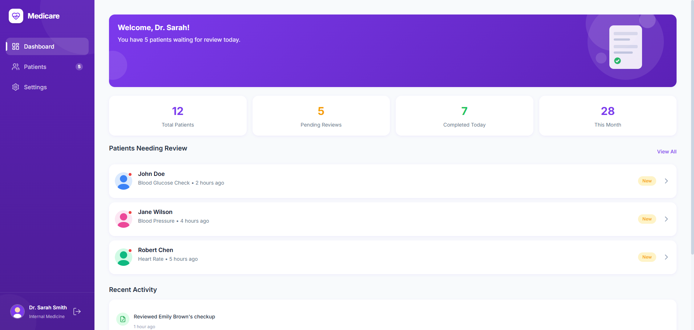
</p>

<p align="center">
  <strong>Mobile View</strong><br>
  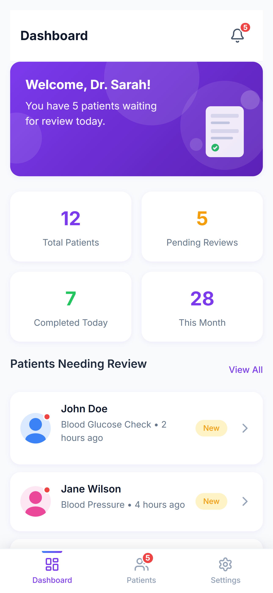
</p>

---

<h3 align="center">Patients</h3>

<p align="center">
  <strong>Desktop View</strong><br>
  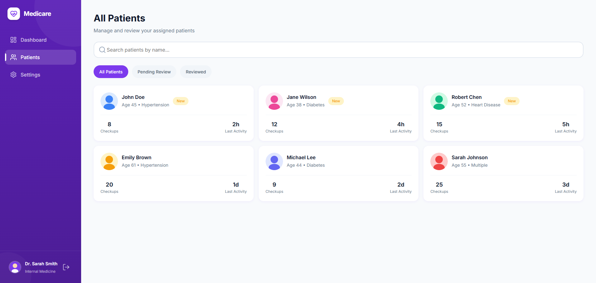
</p>

<p align="center">
  <strong>Mobile View</strong><br>
  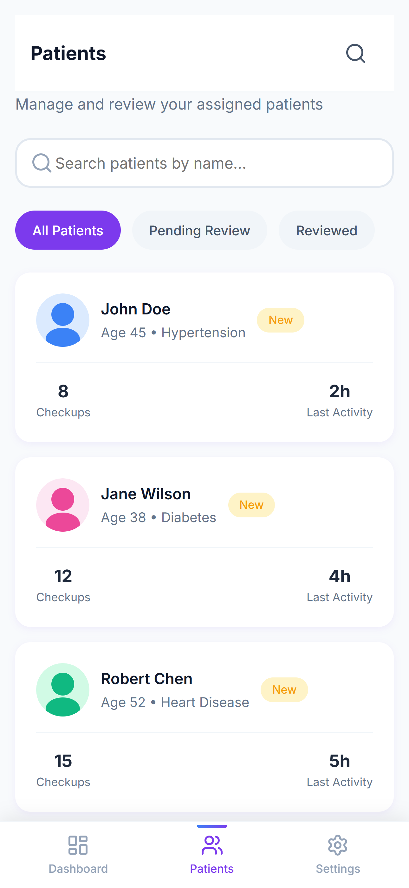
</p>

---

<h3 align="center">Settings</h3>

<p align="center">
  <strong>Desktop View</strong><br>
  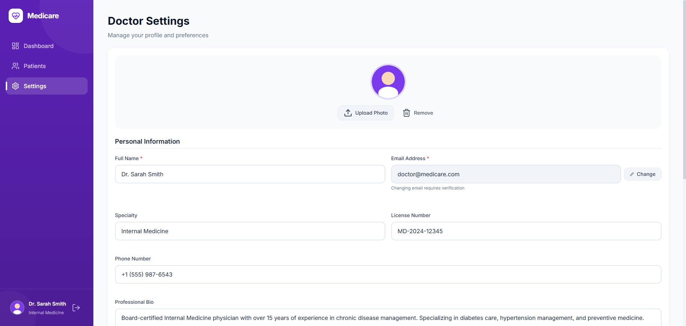
</p>

<p align="center">
  <strong>Mobile View</strong><br>
  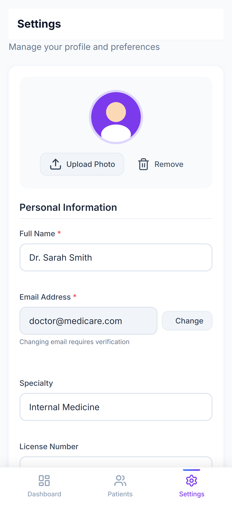
</p>

---

## 🗄 Database Structure (High Level)

```text
users
healthRecords
aiReports
doctorReviews
notifications
```

* Role-based access control
* Secure data isolation per patient
* Doctor access limited to assigned patients

---

## 🔐 Security

* Authentication required for all actions
* Patients can access only their own data
* Doctor can access only assigned patients
* Secure firebase rules

---

## ⚡ Performance

* Fast initial load
* Lazy loading
* Loading indicators for async actions
* Smooth UI transitions

---


## 📄 License

This project is for educational and prototype purposes.
Medical usage must comply with local health regulations.

---

💡 *Built with care for patients, doctors, and clean engineering.*
